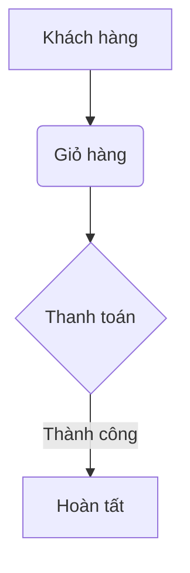

# Trang 1: Giới thiệu
## Chào mừng đến với cuốn sách

Xin chào! Đây là **trang đầu tiên** của cuốn sách điện tử. Chúng ta sẽ cùng khám phá:

- 📚 Giới thiệu tổng quan
- 🎯 Mục tiêu cuốn sách
- 🌟 Các chủ đề chính

> "Học, học nữa, học mãi" - V.I. Lenin

```javascript
// Code sample JavaScript
function greet(name) {
  return `Xin chào, ${name}!`;
}
console.log(greet('Bạn đọc'));
```

---

<!-- pagebreak -->

# Trang 2: Nội dung chi tiết
## Chương 1: Khởi đầu

### 1.1 Cài đặt môi trường
1. Tải công cụ cần thiết
2. Cấu hình hệ thống
3. Kiểm tra phiên bản

### 1.2 Hello World
```python
# Python example
print("Xin chào thế giới!")
```

**Bảng so sánh**:

| Công cụ | Phiên bản | Nền tảng |
|---------|-----------|----------|
| Vue.js  | 3.x       | Web      |
| Flutter | 3.0       | Mobile   |

---

<!-- pagebreak -->

# Trang 3: Hướng dẫn thực hành
## Chương 2: Thực hành cơ bản

### Các bước thực hiện:
1. Tạo project mới
   ```bash
   npm create vue@latest
   ```
2. Cấu trúc thư mục:
   ```
   /src
     /components
     /views
     App.vue
     main.js
   ```
3. Chạy ứng dụng:
   ```bash
   npm run dev
   ```


---

<!-- pagebreak -->

# Trang 4: Nâng cao
## Chương 3: Kỹ thuật chuyên sâu

### State Management
```javascript
// Vue Composition API
import { ref, computed } from 'vue';

const count = ref(0);
const double = computed(() => count.value * 2);
```

### Performance Optimization
- Sử dụng lazy loading
- Code splitting
- Tree shaking

**Công thức toán học**:
$$ E = mc^2 $$

---

<!-- pagebreak -->

# Trang 5: Case Studies
## Dự án thực tế

### 5.1 E-commerce App
- **Tính năng chính**:
  - Quản lý sản phẩm
  - Giỏ hàng
  - Thanh toán



### 5.2 Social Network
- Kết bạn
- Tin nhắn
- News feed

---

<!-- pagebreak -->

# Trang 6: Kết luận & Liên hệ
## Tổng kết

Những điểm chính:
- Vue.js 3 hiệu quả
- Composition API linh hoạt
- Dễ dàng tích hợp

> "Hành trình vạn dặm bắt đầu từ bước chân đầu tiên" - Lão Tử

**Liên hệ**:
- Email: contact@example.com
- Website: [www.example.com](https://www.example.com)
- Điện thoại: +84 123 456 789

Cảm ơn bạn đã đọc!